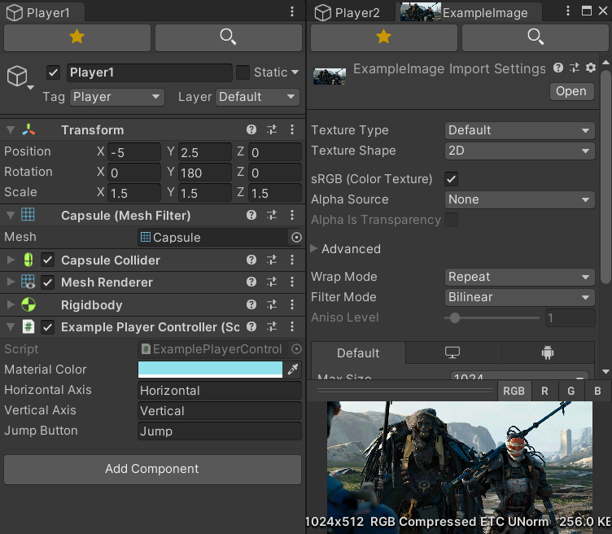
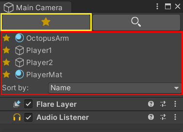
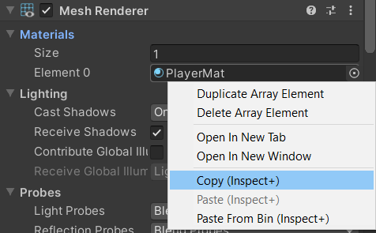
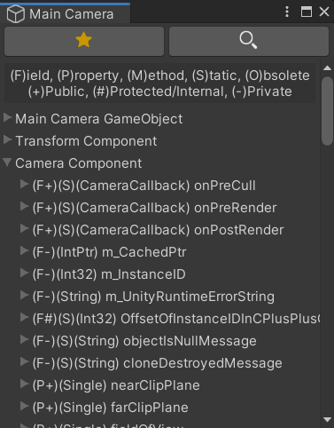
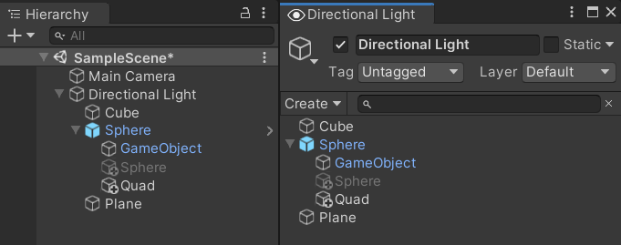
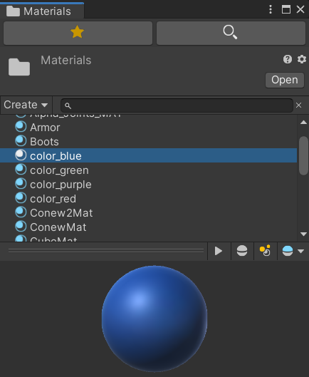
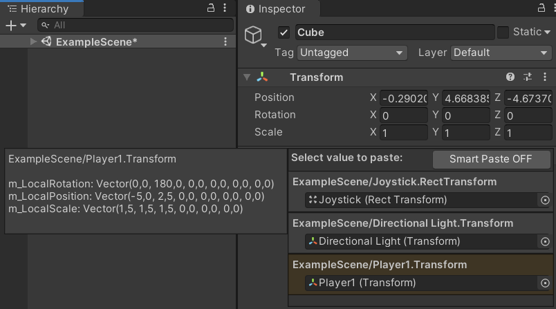
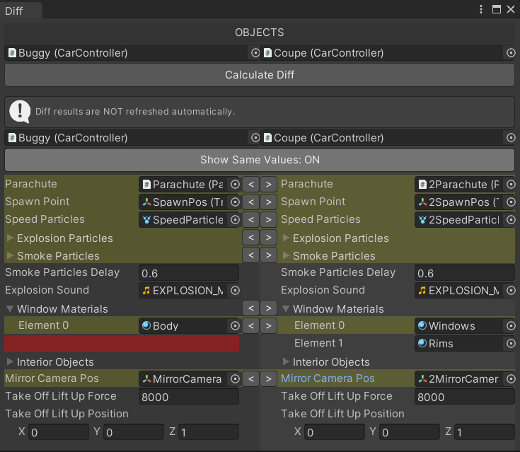

# Unity Inspect+ Plugin

This plugin helps you view an object's Inspector in a separate tab/window, copy&paste the values of variables in the Inspector, inspect all variables of an object (including non-serializable and static variables) in an enhanced Debug mode and more.

**[Support the Developer ☕](https://yasirkula.itch.io/unity3d)**

## INSTALLATION

There are 4 ways to install this plugin:

- import [InspectPlus.unitypackage](https://github.com/yasirkula/UnityInspectPlus/releases) via *Assets-Import Package*
- clone/[download](https://github.com/yasirkula/UnityInspectPlus/archive/master.zip) this repository and move the *Plugins* folder to your Unity project's *Assets* folder
- *(via Package Manager)* add the following line to *Packages/manifest.json*:
  - `"com.yasirkula.inspectplus": "https://github.com/yasirkula/UnityInspectPlus.git",`
- *(via [OpenUPM](https://openupm.com))* after installing [openupm-cli](https://github.com/openupm/openupm-cli), run the following command:
  - `openupm add com.yasirkula.inspectplus`

## HOW TO

- You can open the Inspect+ window in a number of ways: 
  - right clicking an object in *Project* or *Hierarchy* windows
  - right clicking an *Object* variable in the Inspector
  - right clicking a component in the Inspector
  - selecting **Window/Inspect+/New Window** menu item

- You can right click an object in the **History** list to add it to the **Favorites** list
- You can drag&drop objects to the History and Favorites lists to quickly fill these lists
- You can right click the icons of the History and Favorites lists to quickly select an object from these lists

- You can right click variables or components in the Inspector to copy&paste their values. This supports all variable types: primitives, scene objects, assets, managed references, arrays, serializable objects and etc. Paste operation is quite flexible, as well; you can paste different vector types to each other and paste any component to another with no type restrictions, as long as these components have some variables with the same name. Note that copy/paste menu won't show up for variables that are not drawn with *SerializedProperty*
- You can right click an object in Hierarchy and copy its complete hierarchy (with or without its children). Then, you can paste these objects to another Unity project's hierarchy; Unity versions don't need to match (however, assets that don't exist on the other project will become missing references)

- You can right click the Inspect+ tab to enable **Debug mode**: you can inspect all variables of an object in this mode, including static, readonly and non-serializable variables

- You can right click an object in Hierarchy and select the **Isolated Hierarchy** option to open a Hierarchy window that displays only that object's children

- You can open a folder with Inspect+ to see its contents in an isolated Project view

- You can open Paste Bin via **Window/Inspect+/Paste Bin**: this window lists the copied variables and is shared between all Unity projects (so, copying a value in Project A will make that value available in Project B). You can also right click variables, components or materials in the Inspector and select **Paste Values From Bin** to quickly select and paste a value from Paste Bin

- You can open Object Diff Window via **Window/Inspect+/Diff Window**: this window lets you see the differences between two objects in your project (diff of two GameObjects won't include their child GameObjects)

- You can show the Inspect+ window from your editor scripts by calling the `InspectPlusNamespace.InspectPlusWindow.Inspect` functions
